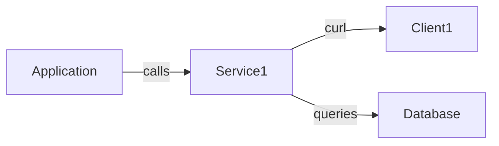
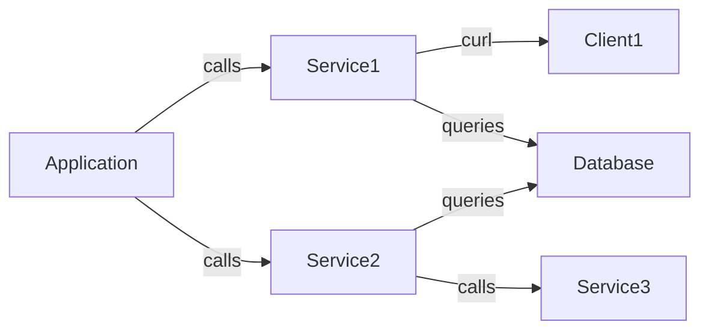

# Dependency Injection

Dependency Injection is a design pattern that allows us to remove the hard-coded dependencies and make our application
loosely coupled, extendable and maintainable. We can implement dependency injection to move the dependency resolution
from compile-time to runtime. This pattern is used to reduce the tight coupling between the software components.
It resolves dependencies during runtime
and therefore comes with performance overhead and reduced validation checking during ahead of execution
which normally happens during compilation.

## Why Dependency Injection?
- Reduces coupling
- easier to test
- easier to maintain as we can replace implementations
  - best used with interfaces ;)

## Types of Dependency Injection
- Constructor Injection (`__construct(MyService $service)`)
- Setter Injection (`LoggerAwareInterface` -> `setLogger(LoggerInterface $logger)`)
- Interface Injection (`ServiceInjector::inject(Client $client) { $client->setService(new SomeService()); }`) 🤷


# Examples
## Basic

```php
class Service1 {
    function __construct(
        private Client $client,
        private Database $database) {
    }
    
    function doSomething() {
        $this->client->sendRequest();
        $this->database->query();
    }
}
class Client1 {}
class Database {}

// application
$service1 = new Service1(new Client1(), new Database());
$service1->doSomething();
```

## Multiple Services


```php
// ...
class Service2 {
    function __construct(
        private Database $database) {
    }
    
    function doSomething() {
        $this->database->query();
    }
}
class Service3 {}

// application
$database = new Database();
$service1 = new Service1(new Client1(), $database);
$service1->doSomething();

// which one?
$service2 = new Service2(new Database(), new Service3());
// or
$service2 = new Service2($database, new Service3());
```